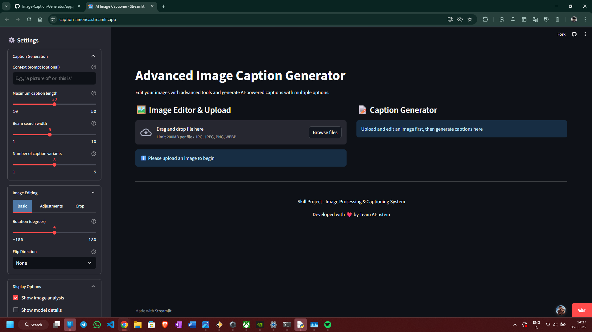
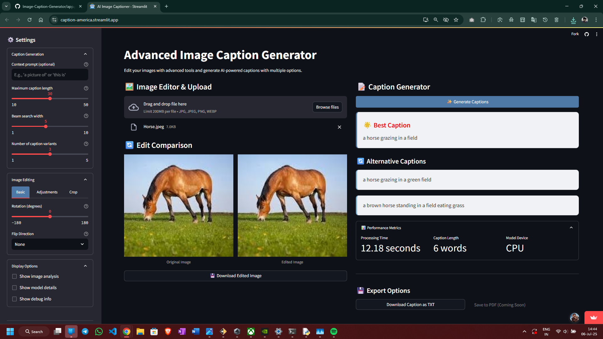
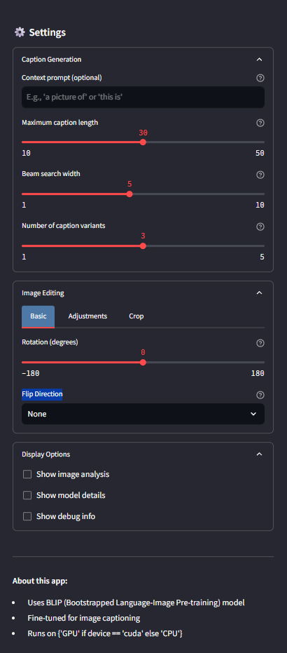
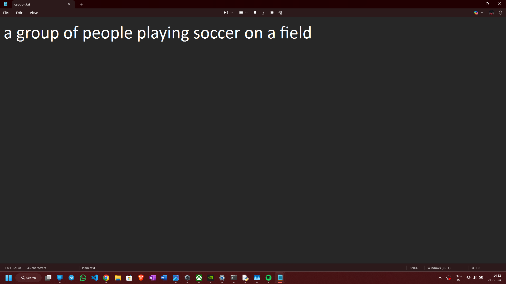

# AI Image Caption Generator

An advanced Streamlit-based application that allows you to upload and edit images, and generate intelligent captions using the powerful BLIP (Bootstrapped Language Image Pretraining) model from Salesforce.

---

## Features

- Generate best and alternative captions for any image
- Image editing: crop, rotate, flip, adjust brightness & contrast
- Uses the `Salesforce/blip-image-captioning-base` model
- Image analysis (brightness, contrast, dominant color, histogram)
- Advanced options: beam search, sampling, custom prompts
- Download caption and edited image
- Runs on CPU or GPU automatically

---

## Installation

### Prerequisites
- Python 3.8 or later
- pip

### Install dependencies
```bash
pip install -r requirements.txt
```

> Create a `requirements.txt` with:
```txt
streamlit
torch
transformers
Pillow
matplotlib
numpy
```

---

## Run the App
```bash
streamlit run app.py
```

The app will open in your default web browser.

---

## Screenshots

###  _Home Page_

##### The main screen of the AI-powered Image Caption Generator app.



### _The following are examples of captions generated by the model_

####  _Generated Caption 1_



####  _Generated Caption 2_


####  _Generated Caption 3_


### _Sidebar_

##### User can configure model parameters and image settings for precise caption output.



### Caption Text (Downloadable .txt file)

##### User can easily export the generated text on local storage in .txt format



---

## Project Structure

```
project-root/
├── app.py                 # Main Streamlit application
├── README.md              # Project documentation
├── requirements.txt       # Dependencies
```

---

## Team AI-nstein

- Sukanti Soren
- Jashmit Mansingh
- Prakash Hembram
- Bibek Mallick
- Prabir Hansda

---

## Model Details

- **Model**: `Salesforce/blip-image-captioning-base`
- **Framework**: PyTorch
- **Inference**: CPU or CUDA (GPU)
- **Source**: Hugging Face Transformers

---

## Future Improvements

- Save captions as PDF
- User history and logs
- Multilingual caption support

---

## License

MIT License © 2025 Team AI-nstein
